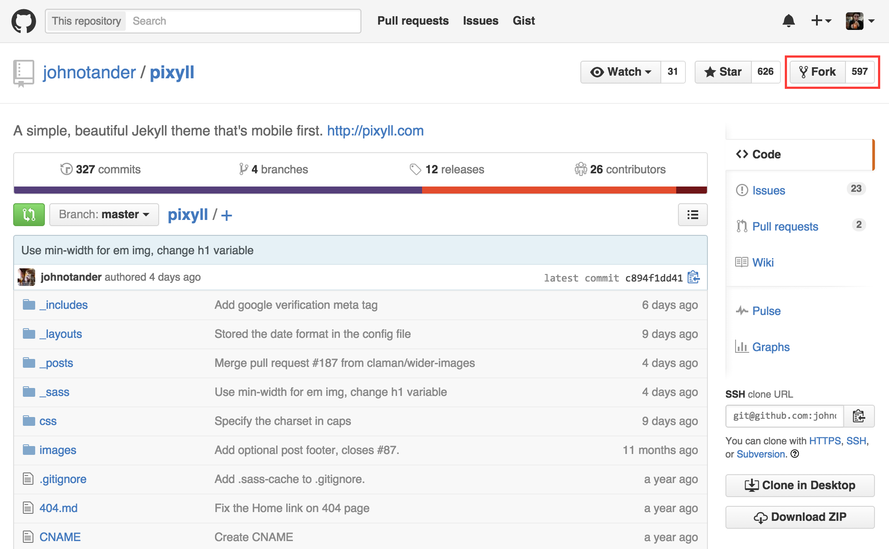
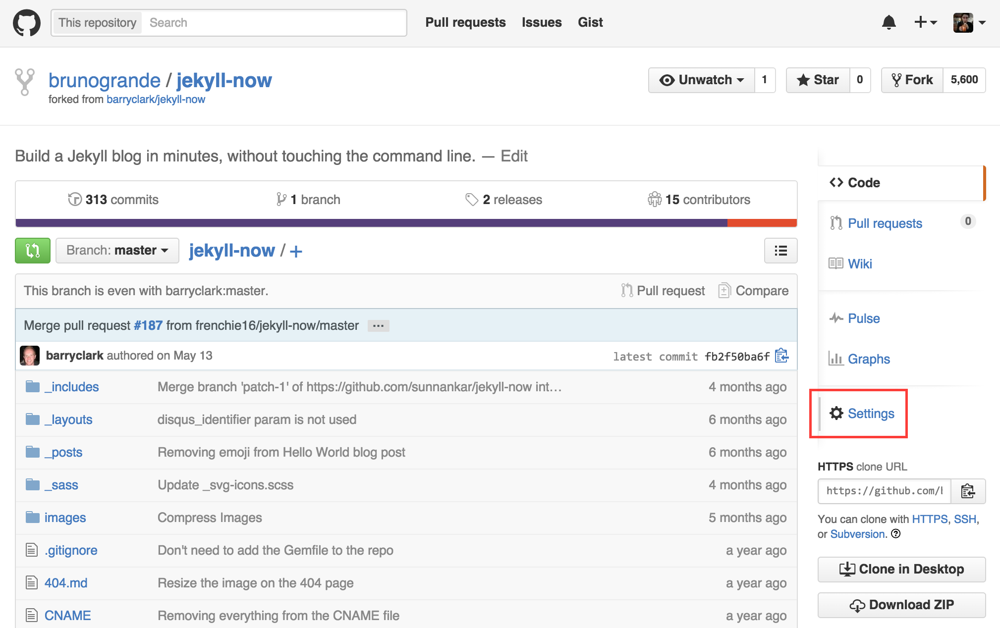
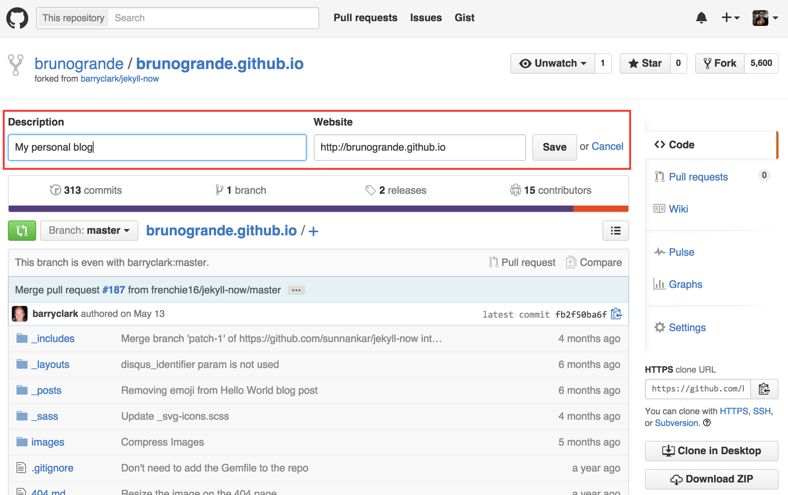
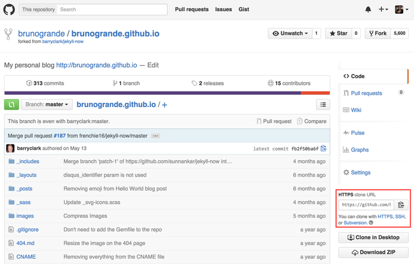
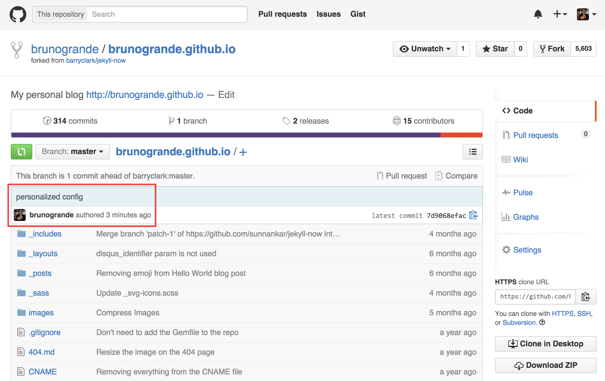
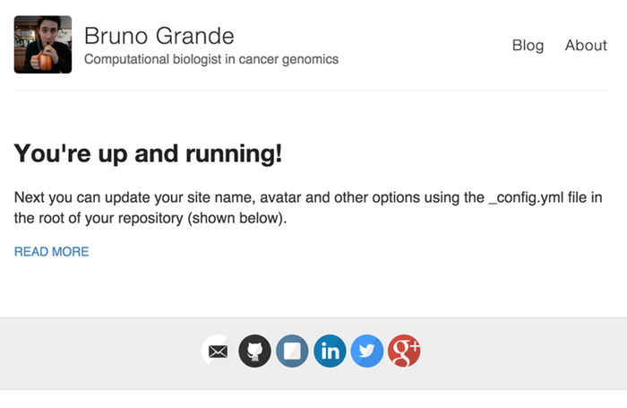

# Setting Up Your Online Presence Using GitHub Pages

- **Author**: Bruno Grande
- **Research field**: Cancer genomics, computational biology
- **Lesson Topic**: GitHub and Git

## Motivation

As the title suggests, this lesson is about setting up your
online presence using GitHub Pages. First, I'd like to explore 
a bit why you should concern yourself with creating a personal
space online. Let's be honest with ourselves: when we hear about
someone that we don't know much about, our reflex is to google
them, right? Well, believe it or not, people will (or already are)
doing that for you. Whether it's colleagues, collaborators or 
future employers, you probably want to leave a good first impression. 

What's the current status of your online presence? Take a look
yourself: open a new browser window in Incognito or Private 
mode and google your name. What comes up? Are any of 
the results on the first page related to you? For some of you, 
your LinkedIn profiles will show up and this is a good start. 
But the reality is that everyone can easily create one. You
can differentiate yourself and gain an edge over others by 
creating a website. You might not know HTML, CSS or JavaScript. 
You also might never have had experience with web hosting. 
This is where GitHub Pages comes in. 

GitHub Pages is a feature offered by GitHub that enables Git
repositories to act as websites. Don't worry though: you don't
need to fully understand Git to use GitHub Pages. In this lesson,
I will introduce some basic concepts to get started. Over time,
you will continue to learn about Git until you become proficient.
This will be worth your while: Git is a powerful version control
system that I recommend you all use. Many things can be tracked by
Git: code, papers, results, etc. Today, we'll focus on your personal
website. Let's get started then!

**Fun fact:** [SciProg.ca](http://sciprog.ca) is actually hosted on 
GitHub Pages. This just comes to show how powerful it can be.

## Lesson Notes

### Forking and Cloning a Template

You can write your own website from scratch, but that takes time
and knowledge about HTML, CSS, JavaScript and Jekyll, the underlying
platform used by GitHub Pages. Instead, we'll kickstart our website
by using a template. For this lesson, I'll be using the [Jekyll Now template]
(https://github.com/barryclark/jekyll-now), but there are [many options]
(http://jekyllthemes.org/) out there. 

The Jekyll Now template repository is owned by [Barry Clark]
(https://github.com/barryclark), meaning that we can't edit it as is. 
We need to create a copy of the repository under our account first. This
is called forking the repository. You may visit the [repository page]
(https://github.com/barryclark/jekyll-now) and click the Fork button at the
top-right. If GitHub prompts your to select an account to store the fork
under, choose your personal GitHub account. 



Next, we need to tidy up our newly created repository fork. First, 
we need to rename it to `<username>.github.io`, where you replace 
`<username>` with your actual GitHub username. This will be your website
address. To rename your repository, visit the Settings page. 



Let's change the repository's description to something more adequate.
For example, the description can be "My personal blog" and the
website will be the same URL as above, `<username>.github.io`. You
can edit the description by clicking the "Edit" link beneath the 
repository name at the top. 



Now that we've done some tidying, we can download the repository. 
In the world of Git, this is done by cloning the repository. As the
name implies, you're creating an exact copy locally. To accomplish this,
copy the link located at the bottom right of the repository page. 
If you haven't set up SSH keys (or haven't heard of SSH keys), make
sure you click the small HTTPS link and then copy the repository link.



Now, open a Bash shell. Navigate to where you want to store your local 
copy of the website. For instance, I have a `Repos` directory where I 
store all of my Git repositories. Then, run the git clone command using 
the link your copied. Git might ask for your GitHub login information. 
You may avoid this by [setting up SSH keys]
(https://help.github.com/articles/generating-ssh-keys/). 

```bash
# Create a Repos directory in your home folder
mkdir -p ~/Repos
# Change directory
cd ~/Repos
# Clone the website repository (replace <username>)
git clone https://github.com/<username>/<username>.github.io.git
```

You now have a local copy of your website repository! Also, if you
visit the URL (`username.github.io`), your website should be live. 
Of course, it isn't personalized yet, but this is what we're gonna
do next. 

### Personalizing your Website

With this template, the first step to personalizing your blog
is editing the configuration file, namely `_config.yml`. This
file contains a few site-wide attributes, such as the blog
title and the image displayed at the top-left. Open `_config.yml`
and edit it to your liking. 

For the avatar, you can use your GitHub avatar. To get the URL,
visit your GitHub profile, right-click your profile picture and
select "Copy Image URL" (or the equivalent in your browser).

----

Those who took the time to install Jekyll can preview their
blog locally by running the following command in a new Bash shell
within their blog repository. To install Jekyll, run the command
`gem install github-pages` (OS X and Linux only; sorry, Windows 
users). You might have to run it with `sudo` prepended to the 
command.

```bash
jekyll serve --watch
```

----

Now that we've started personalizing our blog, we should save
this change. In Git parlance, this is called committing. If you
run `git status` in your repository, you should obtain a list of 
changed files. In this case, it should only be one file: _config.yml.
Here's what the output of `git status` should look like.

```
On branch master
Your branch is up-to-date with 'origin/master'.
Changes not staged for commit:
  (use "git add <file>..." to update what will be committed)
  (use "git checkout -- <file>..." to discard changes in working directory)

	modified:   _config.yml

no changes added to commit (use "git add" and/or "git commit -a")
```

When we commit a change like this one, it allows us to track each
edit we make and this grants us the power of reverting a specific 
change if we mess up. There are two steps to committing a change:

1. Adding the change to the staging area.
	- This allows us to pick and choose which changes we want to 
	commit first, in case there are multiple changes in the repository.
	- In our case, we only have one change, so this step seems a bit
	superfluous. It becomes more useful when your changes are more complex.
2. Commit the change. 
	- This step requires you to provide a message describing the change.
	This is useful when you are looking back at individual changes. 

Using the command-line, we achieve these steps as follows. 

```bash
# Add the changed file to the staging area
git add _config.yml
# Commit the changes by giving a message describing the change
git commit -m 'personalized config'
```

This change is now registered as a commit locally, but GitHub isn't
aware of the change yet. If you were to visit the repository's GitHub
page, you will notice that `_config.yml` is unchanged. In order to sync
our repositories, namely the one we cloned locally and the one on Github,
we need to upload our commits. This is done using the `git push` command.
You might have to enter your GitHub login information here. This is
to prove that you are indeed the owner of the repository. 

```bash
# Upload/push your changes to GitHub
git push
```

Now, if you visit the GitHub page for your repository, you should see your
commit. 



And if you visit your actual blog URL (`<username>.github.io`), you can
see your changes live on the Internet! It might take a few minutes for it
to update.



### Writing Your First Blog Post

----

#### Challenge Problem 1

Edit the `_posts/2014-3-3-Hello-World.md` file as your first blog post. 
When you're done, commit and push those changes to GitHub.

*Answers to challenge problems are located at the bottom of this lesson.*

----

After pushing these changes to GitHub, you can visit your website's URL
(`<username>.github.io`) to see the changes take effect. It might take a 
few minutes for them to appear online. 

### Update the About Page

We're getting somewhere. One last major change we need to do is the About 
page. This will be our second Challenge Problem. Tackle it just like the
blog post.

----

#### Challenge Problem 2

Edit the `about.md` file so that it describes you and what you do. 
When you're done, commit and push those changes to GitHub.

*Answers to challenge problems are located at the bottom of this lesson.*

----

### Playing Around with Markdown

Now that we've set up our blog, it's time to become familiar with what
it can do. Blog posts are written in Markdown format. Read [this page]
(https://guides.github.com/features/mastering-markdown/) for more
information about Markdown. 

----

#### Challenge Problem 3

Create a new blog post called "Markdown Madness" exploring various 
Markdown features. 

*Answers to challenge problems are located at the bottom of this lesson.*

----

## Answers to Challenge Problems

#### Challenge Problem 1

First of all, I changed the name of the blog post file to be
accurate. 

```bash
mv _posts/2014-3-3-Hello-World.md _posts/2015-09-01-first-blog-post.md
```

Then 

```markdown
---
layout: post
title: My First Blog Post
---

I followed [my own lesson](https://github.com/brunogrande/lesson-github-pages/blob/master/lesson/lesson.md) 
to create a personal blog using GitHub Pages. This is an easy (and free) way to 
take control of your online presence. It provides an avenue to share your thoughts
online and a centralized location to link to all of your other accounts online
(_e.g._ Twitter, GitHub and ResearchGate).
```

Once I'm done with my changes, I can commit and push them to 
GitHub as follows.

```bash
# Add the _posts directory to the staging area
git add _posts
# Commit the change with a descriptive message
git commit -m 'created my first blog post'
# Upload/push commits to GitHub
git push
```

#### Challenge Problem 2

Your approach should be the same as in Challenge Problem 1. Here's 
my modified `about.md` file. 

```markdown
---
layout: page
title: About Me
permalink: /about/
---

My name is Bruno Grande and I'm a graduate student at SFU. 
I work in Ryan Morin's lab in the Department of Molecular Biology
and Biochemistry. Despite that, I exclusively do computational biology.
In essence, I use computation to answer biological questions. In our lab, 
our questions focus on cancer genomics, a growing field enabled by next-
generation sequencing. 

### More Information

Check out my [GitHub page](https://github.com/brunogrande) for some of my 
open-source projects, and [Twitter](https://twitter.com/grandebruno) for my 
quick thoughts. 

### Contact me

[bgrande@sfu.ca](mailto:bgrande@sfu.ca)
```

Once you're done editing your About page, commit and push as usual. 

#### Challenge Problem 3

Everything is available in [this handy guide]
(https://guides.github.com/features/mastering-markdown/). Note that 
GitHub Flavored Markdown isn't entirely available on the blog. A notable
exception is syntax highlighting using triple backticks (```). 
